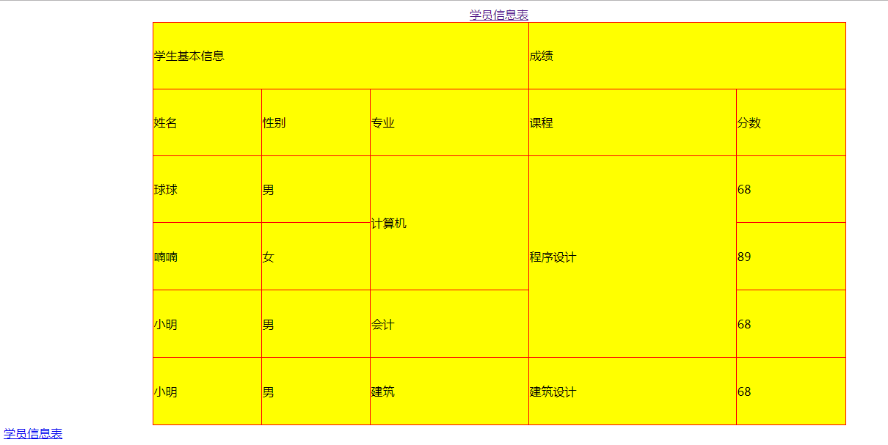

# 表格table

效果如下：
fdfdsdf


代码如下：
```
<!doctype html>
<html lang="en">
<head>
      <meta charset="UTF-8">
      <title>表格</title>
</head>
<body>
<table rules="all" border="1" width="70%" height="550px" align="center" cellspacing="0" bordercolor="red" bgcolor="yellow">
      <caption>
            <a href="#1" name="2">学员信息表</a>
      </caption>
      <tr>
            <td colspan="3">学生基本信息</td>
            <td colspan="3">成绩</td>
      </tr>
      <tr>
            <td>姓名</td>
            <td>性别</td>
            <td>专业</td>
            <td colspan="2">课程</td>
            <td>分数</td>
      </tr>
      <tr>
            <td>球球</td>
            <td>男</td>
            <td rowspan="2">计算机</td>
            <td colspan="2" rowspan="3">程序设计</td>
            <td>68</td>
      </tr>
      <tr>
            <td>喃喃</td>
            <td>女</td>
            <td>89</td>
      </tr>
      <tr>
            <td>小明</td>
            <td>男</td>
            <td>会计</td>
            <td>68</td>
      </tr>
      <tr>
            <td>小明</td>
            <td>男</td>
            <td>建筑</td>
            <td colspan="2">建筑设计</td>
            <td>68</td>
      </tr>
</table>
<a align="center"name="1"href="#2">学员信息表</a>
</body>
</html>

```
